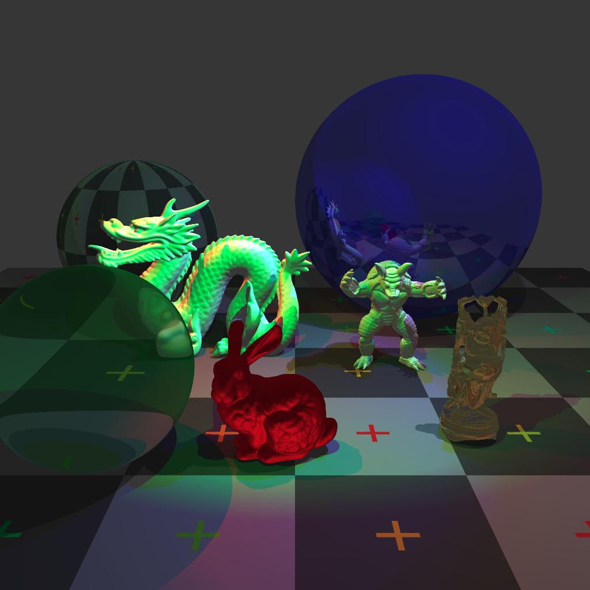

# rust-raytracer
[](https://travis-ci.org/ellishg/rust-raytracer)

A final project for Stanford's CS248 http://cs248.stanford.edu/winter20.


This 1024x1024 image with about 2.3 million triangles was rendered with 16 samples per pixel in about 39 seconds (generating the BVH tree took about 27 seconds) on a 4 core i5-6600K CPU. Thanks to the Stanford Computer Graphics Laboratory for providing these models  at https://graphics.stanford.edu/data/3Dscanrep.

## Running
Use `cargo` to build, test, and run the code. For optimal performace, use the release build. The following command will render a basic scene to out.png with size 1024x1024.
```bash
#cargo run --release -- <args>
cargo run --release -- -f out.png -w 1024
```

To print useful timing information, set the environment variable `RUST_LOG`.
```bash
RUST_LOG=debug cargo run --release
```

## Testing
```bash
cargo test
```

## TODO
- [x] Move structs into their own files
- Lights
  - [x] Ambient
  - [x] Point
  - [x] Cone
  - [x] Directional
- Shadows
  - [ ] Soft shadows
  - [ ] Correct shadows from transparent surfaces
- Objects
  - [x] Sphere
  - [x] Plane
  - [x] Triangle
  - [x] Triangle Meshes
    - [x] BVH
      - [ ] Parallelize
- Materials
  - [x] Flat
  - [x] Phong
  - [x] Reflective
  - [x] Transparent
  - [x] Texture
    - [ ] Super sample texture
- Tracing
  - [x] Anti-aliasing
  - [ ] Focus blur
- [x] Threads
